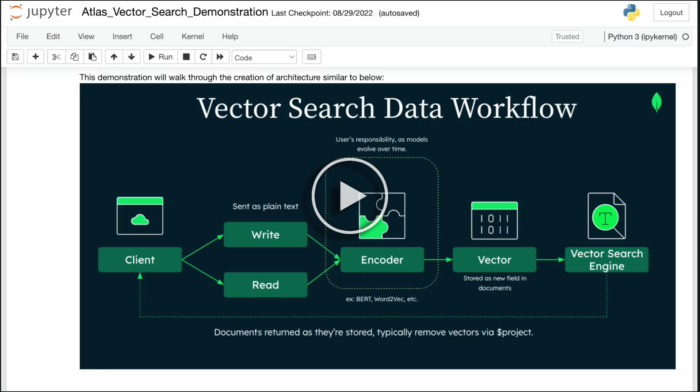

## Atlas Vector Search

Using MongoDB Atlas' Vector Search engine, we store dense vectors and calculate similarities all within the data storage layer.

See the short video below:

[](https://www.youtube.com/watch?v=un4mRr1G6Js)

[Jupyter Notebook Demonstration](Atlas_Vector_Search_Demonstration.ipynb)

### 1. Install Dependencies

``` shell
pip install sentence_transformers, pymongo
```

### 2. Import Libraries
We'll be using a popular pre-trained sentence transformer model. You can alternatively train your own or re-train an existing one.

``` python
from sentence_transformers import SentenceTransformer, util
model = SentenceTransformer('sentence-transformers/all-MiniLM-L6-v2')

import pymongo
connection = pymongo.MongoClient(mongo_uri)
vector_collection = connection['eap']['vector']
```

### 3. Prepare Corpus
Convert each object's name into its' corresponding vector embedding, then store it in the vector database.

``` python
products = [
    {"name": "Mozzarella"},
    {"name": "Parmesan"},
    {"name": "Cheddar"},
    {"name": "Brie"},
    {"name": "Swiss"},
    {"name": "Gruyere"},
    {"name": "Feta"},
    {"name": "Gouda"},
    {"name": "Provolone"},
    {"name": "Monterey Jack"}
]

# create a new embedding field for each product object
for product in products:
  # convert to embedding, then to array
    embeddings = model.encode(product['name']).tolist()
    product['embedding'] = embeddings
    vector_collection.insert(product)
```

### 4. Create Vector Index
We use the default [HNSW](https://github.com/esteininger/vector-search#similarity-search) KNN index structure when we create our field mapping definition:

```json
{
  "mappings": {
    "fields": {
      "embedding": [
        {
          "dimensions": 384,
          "similarity": "euclidean",
          "type": "knnVector"
        }
      ]
    }
  }
}
```

### 5. Calculate Similarity
The heart of vector search is in the similarity calculation. Here we use [cosine similarity](https://www.sbert.net/docs/package_reference/util.html#sentence_transformers.util.cos_sim) but you can experiment with others.
```python
query = "cheese"
vector_query = model.encode(query).tolist()

pipeline = [
    {
        "$search": {
            "knnBeta": {
                "vector": vector_query,
                "path": "embedding",
                "k": 10
            }
        }
    },
    {
        "$project": {
            "embedding": 0,
            "_id": 0,
            'score': {
                '$meta': 'searchScore'
            }
        }
    }
]
```

## Retrieval Augmentation

Retrieval augmentation is a technique for improving QA bots by augmenting the prompt with relevant documents retrieved from a knowledge base. This helps the bots to access information outside of their training set and improve interpretability. However, it can be challenging to retrieve relevant documents and for the bots to understand them.


[Further Reading](https://ai.facebook.com/blog/retrieval-augmented-generation-streamlining-the-creation-of-intelligent-natural-language-processing-models/)

### Rough Steps
1. Accept corpus
2. Split into chunks
3. Embed the chunks
4. Ask a question (Q)
5. Return top K chunks
6. Run chunks through GPT
7. Return results in a structured form

## Advanced Workflow

1. Embedding
2. ANN Search
3. Filter
4. Re-Ranking


- [Model versioning, hosting, and scaling](https://github.com/esteininger/vector-search#architecture)
- Implement any number of the [vector search use cases](https://github.com/esteininger/vector-search#use-cases)

## Links
- [Lucene HNSW Data Type](https://lucene.apache.org/core/9_0_0/core/org/apache/lucene/codecs/lucene90/Lucene90HnswVectorsFormat.html)
